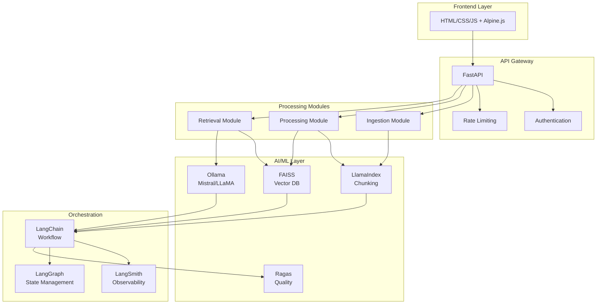
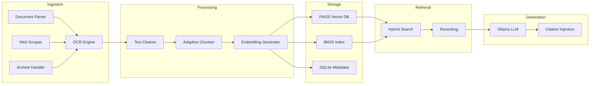
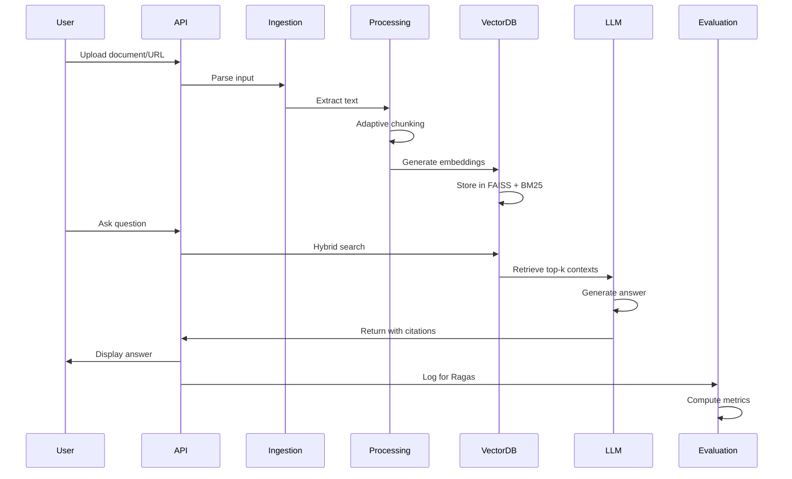
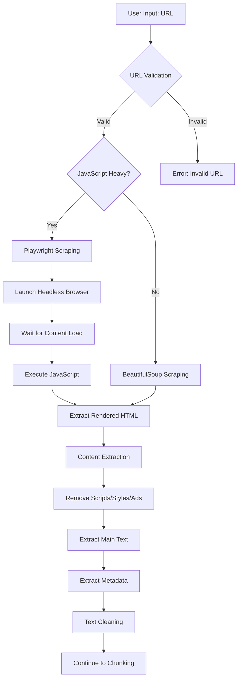
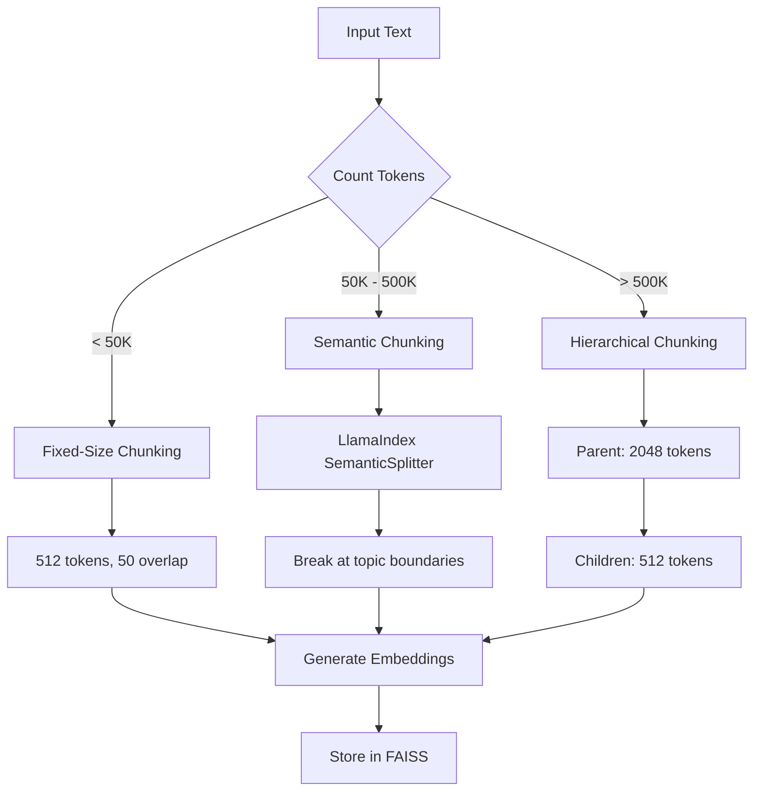

# AI Universal Knowledge Ingestion System
## Enterprise RAG Platform

[](https://www.python.org/downloads/)
[](https://fastapi.tiangolo.com/)
[](https://opensource.org/licenses/MIT)
[](https://ollama.ai/)

> A production-grade, privacy-first document intelligence solution with multi-source ingestion, hybrid retrieval, and zero API costs.

---

## 📋 Table of Contents

- [Executive Summary](#executive-summary)
- [Problem Statement & Market Analysis](#problem-statement--market-analysis)
- [Key Features](#key-features)
- [System Architecture](#system-architecture)
- [Technology Stack](#technology-stack)
- [Project Structure](#project-structure)
- [Installation](#installation)
- [Usage](#usage)
- [System Workflows](#system-workflows)
- [AI/ML Models & Techniques](#aiml-models--techniques)
- [Evaluation Metrics](#evaluation-metrics)
- [Implementation Roadmap](#implementation-roadmap)
- [Risk Assessment](#risk-assessment)
- [Success Metrics](#success-metrics)
- [Contributing](#contributing)
- [License](#license)

---

## 🎯 Executive Summary

The **AI Universal Knowledge Ingestion System** addresses a critical enterprise pain point: information silos that cost organizations **20% of employee productivity** (equivalent to **$5M annually** per 1,000 employees). 

Unlike existing solutions (Humata AI, ChatPDF, NotebookLM) that charge **$49/user/month** and rely on expensive cloud LLM APIs, this system offers:

### Key Differentiators

| Feature | Competitors | Our System |
|---------|-------------|------------|
| **💰 Cost** | $49-99/user/month + API fees | $0 API costs (on-premise) |
| **🔒 Privacy** | Cloud-based (OpenAI/Anthropic) | 100% on-premise processing |
| **📥 Input Types** | PDFs only | URLs + Documents + ZIP archives (up to 2GB) |
| **📊 Quality Metrics** | None (black box) | Ragas evaluation (quantified) |
| **🔍 Retrieval** | Vector-only | Hybrid (Vector + BM25) |
| **👁️ Observability** | Basic logging | LangSmith full tracing |

### Market Opportunity

- 📈 **$8.5B projected market** by 2027
- 💼 **85% of enterprises** actively adopting AI-powered knowledge management
- 🏆 Proven competitors generating **$2M-10M+ annual revenue**
- 🔐 Growing regulatory demands for **on-premise, privacy-compliant solutions**

---

## 🚨 Problem Statement & Market Analysis

### The Knowledge Discovery Crisis

| Problem Area | Impact | Annual Cost (per 1,000 employees) |
|--------------|--------|-----------------------------------|
| Information Search Time | 20% of workday wasted | $5M |
| Knowledge Silos | Incomplete decision-making | $2.5M |
| Manual Document Review | 15-20 min per document | $75K per legal team |
| Compliance Gaps | Regulatory violations | $1M+ in fines |

### Limitations of Existing Solutions

**Commercial Tools (Humata AI, ChatPDF, NotebookLM):**
- ❌ High costs: $49-99/user/month + per-token API fees
- ❌ Privacy risks: Data sent to OpenAI/Anthropic servers
- ❌ Limited input types: PDF-only (no URLs or archives)
- ❌ No quality metrics: Black-box systems
- ❌ Fixed chunking: One-size-fits-all reduces accuracy

**Our Solution:**
- ✅ Zero API costs with Ollama (on-premise LLMs)
- ✅ Complete privacy (data never leaves infrastructure)
- ✅ Multi-source ingestion (URLs + Documents + ZIP)
- ✅ Quantified quality (Ragas metrics)
- ✅ Adaptive processing (intelligent chunking strategies)

---

## ✨ Key Features

### 📥 Multi-Source Ingestion
- Upload PDFs, Word docs, text files, images (with OCR)
- **Paste URLs** for automatic web scraping (handles JS-rendered sites)
- **Upload ZIP archives** (up to 1-2GB) with automatic extraction
- Parallel processing for simultaneous operations

### 🧠 Intelligent Processing
- **Adaptive chunking**: Auto-selects strategy based on content size
  - <50K tokens → Fixed-size chunks (512 tokens)
  - 50K-500K → Semantic chunking (LlamaIndex)
  - >500K → Hierarchical chunks (parent-child)
- **Hybrid retrieval**: Vector similarity + BM25 keyword matching
- Real-time progress tracking
- Context window management with overlap

### 💬 Advanced Chat Interface
- Natural language queries with precise, context-aware answers
- **Source citations** with page numbers and URLs
- Adjustable parameters (temperature, top-p, max tokens)
- Multi-document comparison and cross-referencing
- Auto-generate executive summaries

### 📊 Quality & Observability
- **Ragas evaluation**: Answer relevancy, faithfulness, context precision
- **LangSmith monitoring**: Real-time tracing and debugging
- Response confidence scores
- Retrieval performance analytics

### 📤 Export & Collaboration
- Export Q&A history as reports (PDF/DOCX)
- Save conversation threads
- Bookmark important insights
- Generate shareable knowledge bases

---

## 🏗️ System Architecture

### High-Level Architecture



### Core Components



---

## 🛠️ Technology Stack

| Layer | Technology | Justification |
|-------|------------|---------------|
| **Frontend** | HTML/CSS/JavaScript + Alpine.js | Lightweight reactivity without React complexity |
| **Backend API** | FastAPI (Python 3.11+) | Async support, auto-docs, production-grade |
| **LLM Inference** | Ollama (Mistral-7B / LLaMA-2-13B) | Zero API costs, on-premise, 20-30 tokens/sec |
| **Vector Database** | FAISS (Facebook AI) | Battle-tested, 10x faster than ChromaDB |
| **Embeddings** | sentence-transformers (bge-small-en-v1.5) | SOTA quality, 384-dim, GPU/CPU compatible |
| **Chunking/Retrieval** | LlamaIndex 0.9+ | Advanced semantic chunking |
| **Orchestration** | LangChain + LangGraph | Workflow management, state handling |
| **Observability** | LangSmith | Production monitoring, debugging |
| **Evaluation** | Ragas 0.1+ | Automated RAG quality metrics |
| **Web Scraping** | Playwright + BeautifulSoup | Handles JS-rendered sites + static pages |
| **OCR** | EasyOCR | Multilingual, GPU-accelerated |
| **Keyword Search** | rank_bm25 | Fast BM25 implementation |
| **Caching** | Redis (optional) / In-memory LRU | Reduce embedding computation |
| **Database** | SQLite / PostgreSQL | Metadata, chat history |
| **Deployment** | Docker + Railway/Render | Containerized, scalable |

---

## 📁 Project Structure

```
rag-knowledge-system/
│
├── main.py                    # FastAPI application entry point
├── requirements.txt           # Python dependencies
├── Dockerfile                 # Container configuration
├── docker-compose.yml         # Multi-container setup
├── .env.example              # Environment variables template
├── README.md                 # This file
│
├── config/                   # Configuration files
│   ├── settings.py          # App settings (models, paths, parameters)
│   ├── prompts.py           # LLM prompt templates
│   └── logging.py           # Logging configuration
│
├── api/                      # FastAPI routes and endpoints
│   ├── __init__.py
│   ├── upload.py            # Document/URL upload endpoints
│   ├── query.py             # Chat query endpoints
│   ├── export.py            # Export Q&A endpoints
│   └── health.py            # Health check endpoints
│
├── ingestion/                # Data ingestion modules
│   ├── __init__.py
│   ├── document_parser.py   # PDF/DOCX/TXT parsing
│   ├── web_scraper.py       # Playwright/BeautifulSoup scraping
│   ├── ocr_engine.py        # EasyOCR integration
│   ├── zip_handler.py       # ZIP extraction and processing
│   └── async_processor.py   # Parallel processing coordinator
│
├── chunking/                 # Text chunking strategies
│   ├── __init__.py
│   ├── fixed_chunker.py     # Fixed-size chunking
│   ├── semantic_chunker.py  # LlamaIndex semantic chunking
│   ├── hierarchical_chunker.py  # Parent-child chunking
│   └── adaptive_selector.py # Auto-select chunking strategy
│
├── embeddings/               # Embedding generation
│   ├── __init__.py
│   ├── bge_embedder.py      # BGE-small-en-v1.5 embeddings
│   └── batch_processor.py   # Batch embedding generation
│
├── vector_store/             # Vector database operations
│   ├── __init__.py
│   ├── faiss_manager.py     # FAISS index management
│   ├── bm25_index.py        # BM25 keyword index
│   └── metadata_store.py    # SQLite metadata storage
│
├── retrieval/                # Retrieval and search
│   ├── __init__.py
│   ├── hybrid_search.py     # Vector + BM25 hybrid retrieval
│   ├── reranker.py          # Cross-encoder reranking
│   └── context_assembly.py  # Context merging and formatting
│
├── generation/               # LLM generation
│   ├── __init__.py
│   ├── ollama_client.py     # Ollama API client
│   ├── prompt_builder.py    # Dynamic prompt construction
│   └── citation_injector.py # Add source citations
│
├── evaluation/               # Quality evaluation
│   ├── __init__.py
│   ├── ragas_evaluator.py   # Ragas metrics integration
│   └── langsmith_logger.py  # LangSmith tracing
│
├── utils/                    # Utility functions
│   ├── __init__.py
│   ├── text_cleaner.py      # Text preprocessing
│   ├── cache_manager.py     # Redis/LRU caching
│   └── progress_tracker.py  # Real-time progress updates
│
├── frontend/                 # Frontend files
│   ├── index.html           # Main UI
│   ├── styles.css           # CSS styling
│   ├── app.js               # Alpine.js app logic
│   └── assets/              # Images, icons
│
├── data/                     # Data storage (gitignored)
│   ├── uploads/             # Temporary uploaded files
│   ├── vector_db/           # FAISS indices
│   ├── metadata/            # SQLite databases
│   └── cache/               # Cached embeddings
│
├── docs/                     # Documentation
│   ├── ARCHITECTURE.md      # Detailed architecture
│   ├── API.md               # API documentation
│   ├── DEPLOYMENT.md        # Deployment guide
│   └── CONTRIBUTING.md      # Contribution guidelines
│
└── tests/                    # Unit and integration tests
    ├── __init__.py
    ├── test_ingestion.py
    ├── test_chunking.py
    ├── test_retrieval.py
    └── test_generation.py
```

---

## 🚀 Installation

### Prerequisites

- Python 3.11+
- Ollama installed ([Installation Guide](https://ollama.ai/))
- 8GB+ RAM (16GB recommended)
- Optional: NVIDIA GPU with CUDA for faster inference

### Step 1: Clone Repository

```bash
git clone https://github.com/satyaki-mitra/rag-knowledge-system.git
cd rag-knowledge-system
```

### Step 2: Create Virtual Environment

```bash
python -m venv venv
source venv/bin/activate  # On Windows: venv\Scripts\activate
```

### Step 3: Install Dependencies

```bash
pip install -r requirements.txt
```

### Step 4: Install Playwright Browsers

```bash
playwright install chromium
```

### Step 5: Pull Ollama Models

```bash
ollama pull mistral:7b-instruct
# Or for larger model:
# ollama pull llama2:13b-chat
```

### Step 6: Configure Environment

```bash
cp .env.example .env
# Edit .env with your settings
```

### Step 7: Initialize Directories

```bash
mkdir -p data/{uploads,vector_db,metadata,cache}
```

### Step 8: Run Application

```bash
uvicorn main:app --host 0.0.0.0 --port 8000 --reload
```

Visit: http://localhost:8000

---

## 📖 Usage

### 1. Upload Documents

**Via Web Interface:**
- Drag-and-drop PDFs, DOCX, TXT files
- Paste URL for web scraping
- Upload ZIP archives (up to 2GB)

**Via API:**
```bash
curl -X POST "http://localhost:8000/api/upload" \
  -F "file=@document.pdf"
```

### 2. Query Knowledge Base

**Web Interface:**
- Type natural language questions
- Adjust temperature (0.0-1.0) and top-p (0.1-1.0)
- View citations and confidence scores

**API:**
```bash
curl -X POST "http://localhost:8000/api/query" \
  -H "Content-Type: application/json" \
  -d '{"query": "What are the key risks mentioned?", "temperature": 0.7}'
```

### 3. Export Results

```bash
curl -X GET "http://localhost:8000/api/export/pdf?session_id=abc123" \
  --output report.pdf
```

---

## 🔄 System Workflows

### End-to-End Data Flow



### URL Scraping Workflow



### Adaptive Chunking Decision



---

## 🤖 AI/ML Models & Techniques

### Large Language Models

#### Primary: Mistral-7B-Instruct-v0.2

| Specification | Value |
|---------------|-------|
| Parameters | 7.3B |
| Context Window | 32K tokens |
| Performance | 20-30 tokens/sec (RTX 3090) |
| Memory | ~14GB VRAM (FP16), ~7GB (4-bit) |
| Strengths | Instruction following, reasoning, multilingual |

#### Alternative: LLaMA-2-13B-Chat

| Specification | Value |
|---------------|-------|
| Parameters | 13B |
| Context Window | 4K tokens |
| Performance | 12-18 tokens/sec (RTX 3090) |
| Memory | ~26GB VRAM (FP16), ~13GB (4-bit) |
| Strengths | Detailed responses, complex queries |

### Embedding Models

**Primary: BAAI/bge-small-en-v1.5**

| Metric | Value | Comparison |
|--------|-------|------------|
| Parameters | 33M | 10x smaller than OpenAI ada-002 |
| Dimensions | 384 | Optimal balance quality vs speed |
| MTEB Score | 62.17 | Competitive with commercial |
| Speed | 1000 docs/sec (CPU) | 10x faster than all-MiniLM |
| Memory | ~130MB | Edge device compatible |

**Advantages over OpenAI Embeddings:**
- ✅ Zero cost ($0 vs $0.0001/1K tokens)
- ✅ Complete privacy
- ✅ 5-10x faster (no network latency)
- ✅ Offline capable
- ✅ Fine-tunable on domain data

### Retrieval Algorithms

#### Hybrid Retrieval Formula

```
Final_Score = 0.6 × Vector_Similarity + 0.4 × BM25_Score
```

**Reciprocal Rank Fusion (RRF):**
```
RRF(document) = Σ 1/(k + rank_i(document))
where k = 60
```

#### BM25 Scoring

```
BM25(D,Q) = Σ IDF(qi) × (f(qi,D) × (k1+1)) / (f(qi,D) + k1×(1-b+b×|D|/avgdl))
```

Parameters:
- k1 = 1.5 (term saturation)
- b = 0.75 (length normalization)

---

## 📊 Evaluation Metrics

### Ragas Quality Metrics

| Metric | Definition | Target | Formula |
|--------|------------|--------|---------|
| **Answer Relevancy** | How well answer addresses question | > 0.85 | cosine(question_emb, answer_emb) |
| **Faithfulness** | Answer grounded in context | > 0.90 | supported_claims / total_claims |
| **Context Precision** | Relevant chunks ranked high | > 0.80 | Σ (precision@k × rel(k)) / total_relevant |
| **Context Recall** | All necessary info retrieved | > 0.85 | attributed_statements / total_statements |

### Performance Targets

| Metric | Target | Measurement |
|--------|--------|-------------|
| Query Latency (p95) | < 5 seconds | LangSmith traces |
| Indexing Speed | > 50 pages/min | Backend logs |
| Memory Usage | < 8GB RAM | Docker stats |
| Uptime | > 99.5% | UptimeRobot |
| Scraping Success | > 85% | Error tracking |

---

## 🗓️ Implementation Roadmap

### Phase 1: MVP Foundation (Weeks 1-2) - 62 hours

**Week 1: Core Infrastructure (30 hours)**
- FastAPI backend setup (4h)
- Document parsing PDF/DOCX (6h)
- Basic chunking (4h)
- FAISS integration (6h)
- Ollama setup (4h)
- Simple HTML frontend (6h)

**Week 2: URL Scraping & Hybrid Retrieval (32 hours)**
- Playwright web scraper (10h)
- BM25 keyword search (4h)
- Hybrid fusion logic (6h)
- Citation tracking (4h)
- Progress tracking UI (4h)
- Testing & bug fixes (4h)

### Phase 2: Advanced Features (Weeks 3-4) - 60 hours

**Week 3: Adaptive Chunking & Quality (30 hours)**
- LlamaIndex semantic chunking (6h)
- Adaptive strategy selector (4h)
- ZIP file handling (6h)
- Ragas evaluation integration (8h)
- LangSmith monitoring (6h)

**Week 4: Polish & Deployment (30 hours)**
- Temperature/top-p controls (3h)
- Caching layer (4h)
- Export Q&A reports (4h)
- Frontend refinements (6h)
- Docker containerization (4h)
- Deploy to Railway (4h)
- Documentation (5h)

**Total: 122 hours (4-5 weeks part-time)**

---

## ⚠️ Risk Assessment

### Technical Risks

| Risk | Probability | Impact | Mitigation |
|------|-------------|--------|------------|
| Anti-scraping blocks | High | Medium | Rotate User-Agents, delays, proxies |
| Ollama performance | Medium | High | 4-bit quantization, request queuing |
| FAISS corruption | Low | High | Auto-backup every 1000 docs |
| Memory overflow | Medium | Medium | Streaming, batch processing, 2GB limit |
| Context overflow | High | Low | Intelligent pruning, warnings at 80% |

### Operational Risks

| Risk | Probability | Impact | Mitigation |
|------|-------------|--------|------------|
| High deployment costs | Medium | High | CPU inference, quantization, spot instances |
| Slow inference | Medium | Medium | Flash Attention 2, vLLM, realistic expectations |
| Poor retrieval accuracy | Low | High | Ragas monitoring, fine-tuning, reranking |
| Data privacy violations | Low | Critical | On-premise docs, no telemetry, compliance audit |

---

## 🎯 Success Metrics

### Technical KPIs

- ✅ Query latency < 5s (p95)
- ✅ Answer relevancy > 0.85
- ✅ Faithfulness > 0.90
- ✅ Context precision > 0.80
- ✅ 99.5% uptime

### User Experience KPIs

- ✅ Time to first query < 3 minutes
- ✅ User satisfaction (NPS) > 40
- ✅ Query success rate > 80%
- ✅ Return user rate > 40%

### Portfolio Impact

- 🌟 GitHub stars: 100+ in 6 months
- 📝 Blog post views: 5,000+ reads
- 💼 LinkedIn engagement: 50+ reactions
- 🎤 Interview mentions: 80% of interviews

---

## 🤝 Contributing

Contributions are welcome! Please follow these steps:

1. Fork the repository
2. Create a feature branch (`git checkout -b feature/amazing-feature`)
3. Commit changes (`git commit -m 'Add amazing feature'`)
4. Push to branch (`git push origin feature/amazing-feature`)
5. Open a Pull Request

See [CONTRIBUTING.md](docs/CONTRIBUTING.md) for detailed guidelines.

---

## 📄 License

This project is licensed under the MIT License - see the [LICENSE](LICENSE) file for details.

---

## 👤 Author

**Satyaki Mitra**
- GitHub: [@satyaki-mitra](https://github.com/satyaki-mitra)
- Location: Kolkata, West Bengal, India
- Role: Data Scientist | AI/ML Engineer
- Experience: 6 Years

---

## 🙏 Acknowledgments

- [Ollama](https://ollama.ai/) for local LLM inference
- [FAISS](https://github.com/facebookresearch/faiss) by Facebook Research
- [LangChain](https://github.com/langchain-ai/langchain) for LLM orchestration
- [LlamaIndex](https://github.com/run-llama/llama_index) for semantic chunking
- [Ragas](https://github.com/explodinggradients/ragas) for RAG evaluation

---

## 📚 Additional Resources

- [Architecture Deep Dive](docs/ARCHITECTURE.md)
- [API Documentation](docs/API.md)
- [Deployment Guide](docs/DEPLOYMENT.md)
- [Blog Post: Building a Production RAG System](#)

---

<div align="center">

**⭐ Star this repo if you find it useful!**

Made with ❤️ for the AI/ML community

</div>