# AI Universal Knowledge Ingestion System - Technical Architecture Document

## 1. System Overview

### 1.1 High-Level Architecture


### 1.2 System Characteristics

| Aspect | Specification |
|--------|---------------|
| **Architecture Style** | Modular Microservices-inspired |
| **Deployment** | Docker Containerized |
| **Processing Model** | Async/Event-driven |
| **Data Flow** | Pipeline-based with Checkpoints |
| **Scalability** | Horizontal (Stateless API) + Vertical (GPU) |

---

## 2. Component Architecture

### 2.1 Ingestion Module


#### Ingestion Specifications:

| Component | Technology | Configuration | Limits |
|-----------|------------|---------------|---------|
| **Web Scraper** | Playwright + BeautifulSoup | Timeout: 30s, Retries: 3 | Max 100 pages/session |
| **PDF Parser** | PyPDF2 + EasyOCR | OCR: English+Multilingual | 1000 pages max |
| **Document Parser** | python-docx, python-pptx | Preserve formatting | 50MB per file |
| **Archive Handler** | zipfile + tarfile | Recursion depth: 5 | 2GB total, 10k files |


### 2.2 Processing Module

#### 2.2.1 Adaptive Chunking Strategy

```mermaid
flowchart TD
    A[Input Text] --> B[Token Count Analysis]
    B --> C{Document Size}
    
    C -->|&lt;50K tokens| D[Fixed-Size Chunking]
    C -->|50K-500K tokens| E[Semantic Chunking]
    C -->|&gt;500K tokens| F[Hierarchical Chunking]
    
    subgraph D [Strategy 1: Fixed]
        D1[Chunk Size: 512 tokens]
        D2[Overlap: 50 tokens]
        D3[Method: Simple sliding window]
    end
    
    subgraph E [Strategy 2: Semantic]
        E1[Breakpoint: 95th percentile similarity]
        E2[Method: LlamaIndex SemanticSplitter]
        E3[Preserve: Section boundaries]
    end
    
    subgraph F [Strategy 3: Hierarchical]
        F1[Parent: 2048 tokens]
        F2[Child: 512 tokens]
        F3[Retrieval: Child → Parent expansion]
    end
    
    D --> G[Chunk Metadata]
    E --> G
    F --> G
    
    G --> H[Embedding Generation]
```



#### 2.2.2 Embedding Pipeline

```python
# Embedding Configuration
EMBEDDING_CONFIG = {
    "model": "BAAI/bge-small-en-v1.5",
    "dimensions": 384,
    "batch_size": 32,
    "normalize": True,
    "device": "cuda" if torch.cuda.is_available() else "cpu",
    "max_sequence_length": 512
}
```

| Parameter | Value | Rationale |
|-----------|-------|-----------|
| **Model** | BAAI/bge-small-en-v1.5 | SOTA quality, 62.17 MTEB score |
| **Dimensions** | 384 | Optimal speed/accuracy balance |
| **Batch Size** | 32 | Memory efficiency on GPU/CPU |
| **Normalization** | L2 | Required for cosine similarity |
| **Speed** | 1000 docs/sec (CPU) | 10x faster than alternatives |

---

### 2.3 Storage Module Architecture


#### Vector Store Configuration

| Index Type | Use Case | Parameters | Performance |
|------------|----------|------------|-------------|
| **IndexFlatL2** | < 100K vectors | Exact search | O(n), High accuracy |
| **IndexIVFFlat** | 100K-1M vectors | nprobe: 10-20 | O(log n), Balanced |
| **IndexHNSW** | > 1M vectors | M: 16, efConstruction: 40 | O(log n), Fastest |


### 2.4 Retrieval Module

#### 2.4.1 Hybrid Retrieval Pipeline


#### 2.4.2 Retrieval Algorithms

**Hybrid Fusion Formula**:

```text
RRF_score(doc) = vector_weight * (1 / (60 + vector_rank)) + bm25_weight * (1 / (60 + bm25_rank))

```

**Default Weights**:

- Vector Similarity: 60%

- BM25 Keyword: 40%

**BM25 Parameters**:

```python
BM25_CONFIG = {
    "k1": 1.5,      # Term frequency saturation
    "b": 0.75,      # Length normalization
    "epsilon": 0.25  # Smoothing factor
}
```

### 2.5 Generation Module

#### 2.5.1 LLM Integration Architecture


#### 2.5.2 LLM Configuration

| Parameter | Default Value | Range | Description |
|-----------|---------------|-------|-------------|
| **Model** | Mistral-7B-Instruct | - | Primary inference model |
| **Temperature** | 0.1 | 0.0-1.0 | Response creativity |
| **Max Tokens** | 1000 | 100-4000 | Response length limit |
| **Top-P** | 0.9 | 0.1-1.0 | Nucleus sampling |
| **Context Window** | 32K | - | Mistral model capacity |


### 2.6 Quality Assurance Module

#### 2.6.1 Ragas Evaluation Pipeline


#### 2.6.2 Evaluation Metrics

| Metric | Target | Measurement Method | Importance |
|--------|--------|-------------------|------------|
| **Answer Relevancy** | > 0.85 | GPT-2 as judge LLM | Core user satisfaction |
| **Faithfulness** | > 0.90 | Grounded in context | Prevents hallucinations |
| **Context Precision** | > 0.80 | Relevant chunks ranked high | Retrieval effectiveness |
| **Context Recall** | > 0.85 | All necessary info retrieved | Completeness of answers |

---

## 3. Data Flow & Workflows

### 3.1 End-to-End Processing Pipeline


### 3.2 Real-time Query Processing


---

## 4. Infrastructure & Deployment

### 4.1 Container Architecture


### 4.2 Resource Requirements

#### 4.2.1 Minimum Deployment

| Resource | Specification | Purpose |
|----------|---------------|---------|
| **CPU** | 4 cores | Document processing, embeddings |
| **RAM** | 8GB | Model loading, FAISS indices |
| **Storage** | 20GB | Models, indices, documents |
| **GPU** | Optional | 2-3x speedup for inference |


#### 4.2.2 Production Deployment

| Resource | Specification | Purpose |
|----------|---------------|---------|
| **CPU** | 8+ cores | Concurrent processing |
| **RAM** | 16GB+ | Larger datasets, caching |
| **GPU** | RTX 3090/4090 | 20-30 tokens/sec inference |
| **Storage** | 100GB+ SSD | Fast vector search |

---

## 5. API Architecture

### 5.1 REST API Endpoints


### 5.2 Request/Response Flow

```python
# Typical Chat Request Flow
REQUEST_FLOW = {
    "authentication": "None (local deployment)",
    "rate_limiting": "100 requests/minute per IP",
    "validation": "Query length, session ID format",
    "processing": "Async with progress tracking",
    "response": "JSON with citations + metrics"
}
```

---

## 6. Monitoring & Observability

### 6.1 LangSmith Integration


### 6.2 Key Performance Indicators

| Category | Metric | Target | Alert Threshold |
|----------|--------|--------|-----------------|
| **Performance** | Query Latency (p95) | < 5s | > 10s |
| **Quality** | Answer Relevancy | > 0.85 | < 0.70 |
| **Quality** | Faithfulness | > 0.90 | < 0.80 |
| **Reliability** | Uptime | > 99.5% | < 95% |
| **Business** | User Satisfaction | > 40 NPS | < 20 |

---

## 7. Technology Stack Details

### Complete Technology Matrix

| Layer | Component | Technology | Version | Purpose |
|-------|-----------|------------|---------|----------|
| **Frontend** | UI Framework | HTML5/CSS3/JS | - | Responsive interface |
| **Frontend** | Styling | Tailwind CSS | 3.3+ | Utility-first CSS |
| **Frontend** | Icons | Font Awesome | 6.0+ | Icon library |
| **Backend** | API Framework | FastAPI | 0.104+ | Async REST API |
| **Backend** | Python Version | Python | 3.11+ | Runtime |
| **AI/ML** | LLM Engine | Ollama | 0.1.20+ | Local LLM inference |
| **AI/ML** | Primary Model | Mistral-7B-Instruct | v0.2 | Text generation |
| **AI/ML** | Embeddings | sentence-transformers | 2.2.2+ | Vector embeddings |
| **AI/ML** | Embedding Model | BAAI/bge-small-en | v1.5 | Semantic search |
| **Vector DB** | Storage | FAISS | 1.7.4+ | Vector similarity |
| **Search** | Keyword | rank-bm25 | 0.2.1 | BM25 implementation |
| **Orchestration** | Workflow | LangChain | 0.0.350+ | Pipeline orchestration |
| **Monitoring** | Observability | LangSmith | - | Tracing & monitoring |
| **Evaluation** | Quality | Ragas | 0.0.22+ | RAG evaluation |
| **Web Scraping** | Dynamic | Playwright | 1.40+ | JS-rendered sites |
| **Web Scraping** | Static | BeautifulSoup4 | 4.12+ | HTML parsing |
| **Document** | PDF | PyPDF2 | 3.0+ | PDF text extraction |
| **Document** | Word | python-docx | 1.1+ | DOCX processing |
| **OCR** | Text Recognition | EasyOCR | 1.7+ | Scanned documents |
| **Database** | Metadata | SQLite | 3.35+ | Local storage |
| **Cache** | In-memory | Redis | 7.2+ | Optional caching |
| **Deployment** | Container | Docker | 24.0+ | Containerization |
| **Deployment** | Orchestration | Docker Compose | 2.20+ | Multi-container |

---

## Conclusion

This comprehensive architecture document provides a complete technical blueprint for the AI Universal Knowledge Ingestion System. The modular design, clear separation of concerns, and production-ready considerations make this system suitable for enterprise deployment while maintaining flexibility for future enhancements.

The architecture successfully demonstrates how to build a privacy-first, cost-effective RAG system that competes with commercial solutions while offering superior control, transparency, and customization capabilities.

Document Version: 1.0
Last Updated: November 2025
Author: Satyaki Mitra

---

> This document is part of the AI Universal Knowledge Ingestion System technical documentation suite.

---


